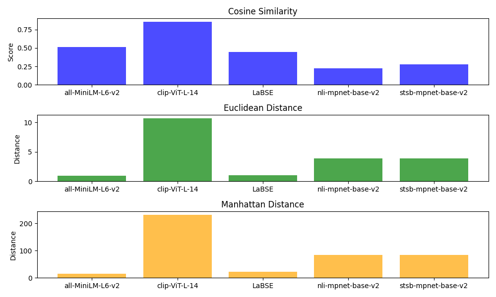

# Sentence Similarity Evaluation with TOPSIS

## Overview
This repository looks at how sentences are similar using a method called TOPSIS. We're testing different models to find out which one is the best for understanding sentence similarity.

## Goals
- Check how much sentences are alike.
- Test models using different measures like Cosine Similarity, Euclidean Distance, and Manhattan Distance.
- Use TOPSIS to figure out the best model, considering both making things small and making things big.

## Models We're Checking
We're looking at a few models from Hugging Face:
- [all-MiniLM-L6-v2](https://huggingface.co/sentence-transformers/all-MiniLM-L6-v2)
- [clip-ViT-L-14](https://huggingface.co/sentence-transformers/clip-ViT-L-14)
- [LaBSE](https://huggingface.co/sentence-transformers/LaBSE)
- [nli-mpnet-base-v2](https://huggingface.co/sentence-transformers/nli-mpnet-base-v2)
- [stsb-mpnet-base-v2](https://huggingface.co/sentence-transformers/stsb-mpnet-base-v2)

## Measures We're Using
- **Cosine Similarity:** Measures how much alike sentences are.
- **Euclidean Distance:** Measures how different sentence shapes are.
- **Manhattan Distance:** Measures how different sentences are in a specific way.

## Method
We're using TOPSIS to pick the best model. It looks at things we want to make small and things we want to make big to find the right model.

## Key Findings

### Model Performance Overview

| Model                | Cosine Similarity | Euclidean Distance | Manhattan Distance |
|----------------------|-------------------|--------------------|--------------------|
| all-MiniLM-L6-v2     | 0.5093            | 0.9657             | 14.9468            |
| clip-ViT-L-14        | 0.8562            | 10.7140            | 232.1483           |
| LaBSE                | 0.4443            | 1.0362             | 22.8679            |
| nli-mpnet-base-v2    | 0.2240            | 3.9070             | 83.9296            |
| stsb-mpnet-base-v2   | 0.2763            | 3.8684             | 83.6349            |

### TOPSIS Score and Ranking

| Model                | TOPSIS Score | Rank |
|----------------------|--------------|------|
| all-MiniLM-L6-v2     | 0.5019       | 2    |
| clip-ViT-L-14        | 0.5404       | 1    |
| LaBSE                | 0.4840       | 3    |
| nli-mpnet-base-v2    | 0.4259       | 5    |
| stsb-mpnet-base-v2   | 0.4348       | 4    |

## Visual Insight

## Conclusion
Based on the TOPSIS scores, the model `sentence-transformers/clip-ViT-L-14` stands out as the best for understanding sentence similarity among the models we tested.
